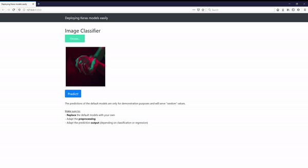

# Deploy Keras models to production level easily

[]()
[](http://perso.crans.org/besson/LICENSE.html)

Make use of Flask & Gevent to deploy your DL models with ease.


## Getting started in 10 minutes

- Clone this repo 
- Install requirements
- Run the script
- Check http://localhost:5000
- Done! :tada:

:point_down:Screenshot:

<p align="center">
  
</p>

------------------

## Local Installation

### Clone the repo
```shell
$ git clone https://github.com/s-gbz/keras-flask-deploy-webapp.git
```

### Install requirements

```shell
$ pip install -r requirements.txt
```

Make sure you have the following installed:
- tensorflow
- keras
- flask
- pillow
- h5py
- gevent

### Run with Python

Python 2.7 or 3.5+ are supported and tested.

```shell
$ python app.py
```

### Play

Open http://localhost:5000 and have fun. :smiley:

<p align="center">
  
</p>

## More resources

Check Siraj's ["How to Deploy a Keras Model to Production"](https://youtu.be/f6Bf3gl4hWY) video. The corresponding [repo](https://github.com/llSourcell/how_to_deploy_a_keras_model_to_production).

[Building a simple Keras + deep learning REST API](https://blog.keras.io/building-a-simple-keras-deep-learning-rest-api.html)
